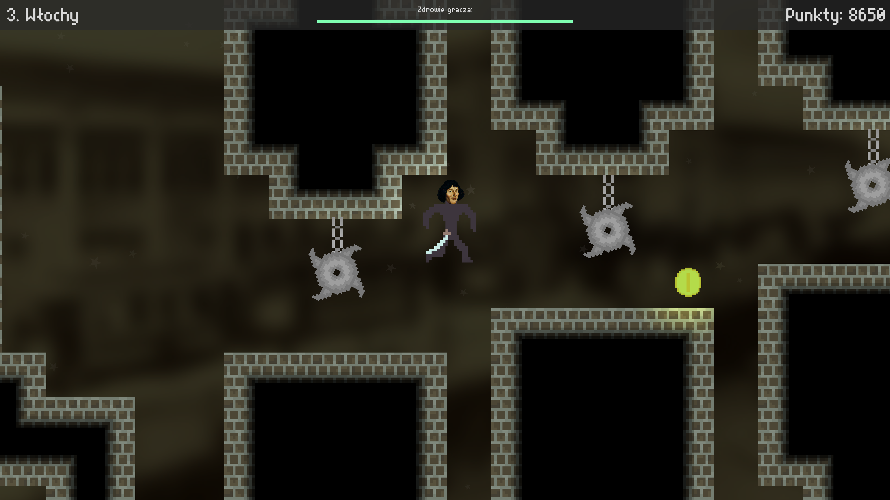
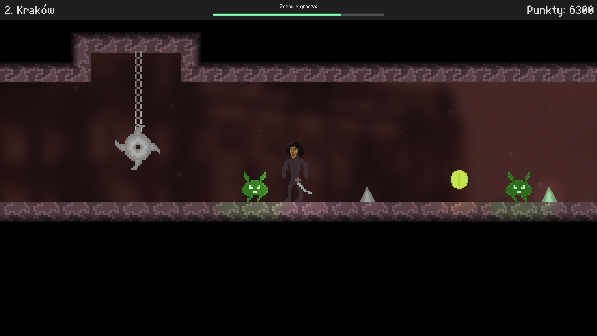

# CopernicusGame

Simple platformer game made in Unity, which tells a brief story about Nicolaus Copernicus' life.

  

The game was initially made using Unity 2020.3.9f1, but it was upgraded to Unity 2021.3.4f1. Originally released as "Kopernik - wędrówka po prawdę". **Currently available only for Windows.**
